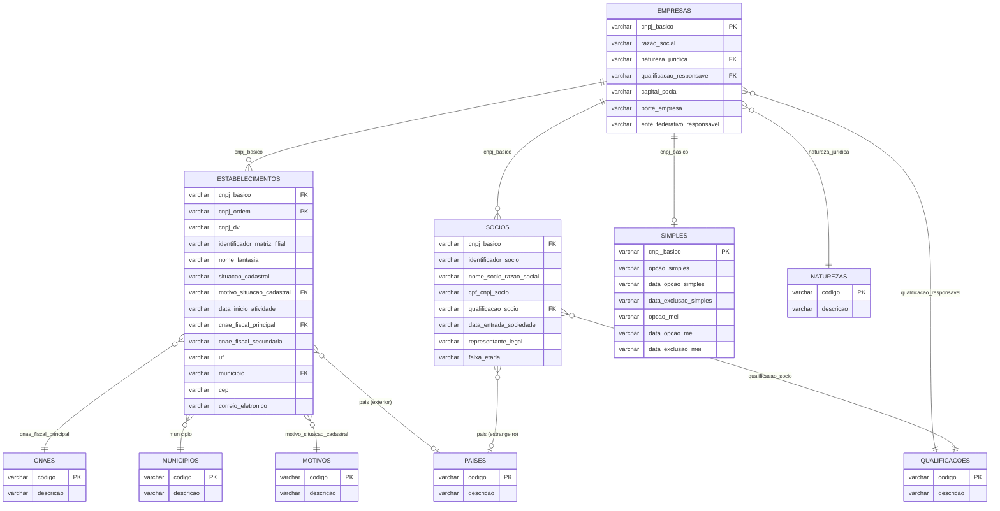

# Dicionário de Dados — `rfb.duckdb`

Camada de consulta sobre os dados abertos de CNPJ da Receita Federal.
O banco contém **apenas views e macros** (zero cópia de dados): as views apontam
para o Parquet particionado em `parquet/tabela=X/safra=Y/`, sempre na safra mais
recente (view `safra_atual` informa qual). Gerado por `scripts/criar_views.py`.

- Safra de referência deste documento: **2026-07**
- Todos os campos são `VARCHAR`, exceto `safra_atual.data_referencia` (`DATE`)
- Datas em formato `AAAAMMDD` (texto); `00000000` significa "sem data"
- Fonte do layout: [cnpj-metadados.pdf](https://www.gov.br/receitafederal/dados/cnpj-metadados.pdf)

## Visão geral

| Objeto | Tipo | Linhas (2026-07) | Descrição |
|---|---|---|---|
| `empresas` | view base | 69.062.850 | Dados cadastrais da raiz do CNPJ |
| `estabelecimentos` | view base | 72.318.948 | Matriz e filiais (CNPJ completo) |
| `socios` | view base | 27.992.378 | Quadro societário |
| `simples` | view base | 49.445.426 | Opção Simples Nacional / MEI |
| `cnaes` | view base (domínio) | 1.359 | Códigos de atividade econômica |
| `motivos` | view base (domínio) | 63 | Motivos de situação cadastral |
| `municipios` | view base (domínio) | 5.572 | Municípios (código RFB, não IBGE) |
| `naturezas` | view base (domínio) | 91 | Naturezas jurídicas |
| `paises` | view base (domínio) | 255 | Países |
| `qualificacoes` | view base (domínio) | 68 | Qualificações de sócio/responsável |
| `empresas_completas` | view enriquecida | — | Empresas + natureza/porte legíveis + flags Simples/MEI |
| `estabelecimentos_completos` | view enriquecida | — | Estabelecimentos + todos os domínios resolvidos |
| `socios_completos` | view enriquecida | — | Sócios + qualificações/faixa etária decodificadas |
| `safra_atual` | view utilitária | 1 | Safra vigente + data de referência |
| `ficha_cnpj(cnpj)` | macro de tabela | — | Ficha completa (aceita 14 dígitos ou 8, com ou sem pontuação) |
| `socios_cnpj(cnpj)` | macro de tabela | — | Quadro societário do CNPJ |
| `busca_nome(termo)` | macro de tabela | — | Busca por razão social / nome fantasia |

Toda view base também expõe `safra` e `tabela` (colunas de partição do Parquet).

---

## empresas

Uma linha por raiz de CNPJ (8 dígitos). Chave: `cnpj_basico`.

| Coluna | Descrição |
|---|---|
| `cnpj_basico` | 8 primeiros dígitos do CNPJ. Chave lógica. Duplicado conhecido: `08314885` (1 linha válida + 1 com razão social NULL, defeito da origem RFB, safra 2026-06) |
| `razao_social` | Nome empresarial |
| `natureza_juridica` | Código; FK lógica → `naturezas.codigo` |
| `qualificacao_responsavel` | Código da qualificação do responsável; FK lógica → `qualificacoes.codigo` |
| `capital_social` | Valor monetário como texto, com vírgula decimal (ex.: `1000,00`) |
| `porte_empresa` | `00` não informado, `01` microempresa, `03` EPP, `05` demais |
| `ente_federativo_responsavel` | Só populado para natureza jurídica do grupo 1XXX (órgãos públicos); em branco no resto — **não é erro** |

## estabelecimentos

Uma linha por estabelecimento (matriz ou filial). Chave: `cnpj_basico + cnpj_ordem + cnpj_dv`.

| Coluna | Descrição |
|---|---|
| `cnpj_basico` | FK lógica → `empresas.cnpj_basico` |
| `cnpj_ordem` | 4 dígitos do meio do CNPJ (`0001` = matriz, em geral) |
| `cnpj_dv` | 2 dígitos verificadores |
| `identificador_matriz_filial` | `1` matriz, `2` filial |
| `nome_fantasia` | — |
| `situacao_cadastral` | `01` nula, `02` ativa, `03` suspensa, `04` inapta, `08` baixada. **Vem com zero à esquerda** |
| `data_situacao_cadastral` | Data do evento da situação (`AAAAMMDD`) |
| `motivo_situacao_cadastral` | Código; FK lógica → `motivos.codigo` |
| `nome_cidade_exterior` | Só para estabelecimento no exterior |
| `pais` | Código; FK lógica → `paises.codigo`. Só para exterior |
| `data_inicio_atividade` | `AAAAMMDD` |
| `cnae_fiscal_principal` | Código; FK lógica → `cnaes.codigo` |
| `cnae_fiscal_secundaria` | **Múltiplos códigos separados por vírgula dentro do mesmo campo** — usar `split(',')` antes de qualquer análise por CNAE |
| `tipo_logradouro` | Ex.: `RUA`, `AVENIDA` |
| `logradouro` | — |
| `numero` | — |
| `complemento` | — |
| `bairro` | — |
| `cep` | 8 dígitos, sem máscara |
| `uf` | Sigla da unidade federativa |
| `municipio` | **Código RFB do município (não é código IBGE)**; FK lógica → `municipios.codigo` |
| `ddd1` / `telefone1` | Telefone principal |
| `ddd2` / `telefone2` | Telefone secundário |
| `ddd_fax` / `fax` | Fax |
| `correio_eletronico` | E-mail |
| `situacao_especial` | Ex.: recuperação judicial (raro) |
| `data_situacao_especial` | `AAAAMMDD` |

## socios

Uma linha por vínculo societário. Sem chave primária na origem
(chave prática: `cnpj_basico + nome_socio_razao_social + cpf_cnpj_socio`).

| Coluna | Descrição |
|---|---|
| `cnpj_basico` | FK lógica → `empresas.cnpj_basico` |
| `identificador_socio` | `1` pessoa jurídica, `2` pessoa física, `3` estrangeiro |
| `nome_socio_razao_social` | Nome do sócio PF ou razão social do sócio PJ |
| `cpf_cnpj_socio` | **Já vem mascarado pela RFB** (CPF: `***NNNNNN**`, por força do art. 129 §2º da Lei 13.473/2017). CNPJ de sócio PJ vem completo |
| `qualificacao_socio` | Código; FK lógica → `qualificacoes.codigo` |
| `data_entrada_sociedade` | `AAAAMMDD` |
| `pais` | Código; FK lógica → `paises.codigo`. Só para sócio estrangeiro |
| `representante_legal` | CPF mascarado do representante |
| `nome_representante` | — |
| `qualificacao_representante_legal` | Código; FK lógica → `qualificacoes.codigo` |
| `faixa_etaria` | Código `0`–`9` **pré-calculado pela RFB** a partir da data de nascimento (não precisa derivar) |

## simples

Uma linha por raiz de CNPJ optante (atual ou histórica). Relação 0..1 com `empresas`.

| Coluna | Descrição |
|---|---|
| `cnpj_basico` | FK lógica → `empresas.cnpj_basico` |
| `opcao_simples` | `S` / `N` |
| `data_opcao_simples` | `AAAAMMDD` ou `00000000` |
| `data_exclusao_simples` | `AAAAMMDD` ou `00000000` |
| `opcao_mei` | `S` / `N` |
| `data_opcao_mei` | `AAAAMMDD` ou `00000000` |
| `data_exclusao_mei` | `AAAAMMDD` ou `00000000` |

## Tabelas de domínio

Todas com o mesmo layout de duas colunas:

| Coluna | Descrição |
|---|---|
| `codigo` | Código usado nas tabelas de fatos |
| `descricao` | Texto descritivo |

| Domínio | Linhas | Referenciado por |
|---|---|---|
| `cnaes` | 1.359 | `estabelecimentos.cnae_fiscal_principal` (e secundária) |
| `motivos` | 63 | `estabelecimentos.motivo_situacao_cadastral` |
| `municipios` | 5.572 | `estabelecimentos.municipio` |
| `naturezas` | 91 | `empresas.natureza_juridica` |
| `paises` | 255 | `estabelecimentos.pais`, `socios.pais` |
| `qualificacoes` | 68 | `empresas.qualificacao_responsavel`, `socios.qualificacao_socio`, `socios.qualificacao_representante_legal` |

## safra_atual

| Coluna | Tipo | Descrição |
|---|---|---|
| `safra` | VARCHAR | Safra vigente das views (`AAAA-MM`) |
| `data_referencia` | DATE | Último dia do mês da safra — usar como "data de hoje" dos dados |

## Views enriquecidas

Joins de domínio já resolvidos e códigos decodificados. Preferir estas para consulta ad hoc.

- **`empresas_completas`**: empresas + `natureza` (descrição), `qualificacao_responsavel_descr`,
  `porte` legível, e flags do Simples (`opcao_simples`, `opcao_mei` + datas, via join com `simples`).
- **`estabelecimentos_completos`**: `cnpj` de 14 dígitos montado, `razao_social`,
  `matriz_filial` / `situacao` / `porte` legíveis, `cnae_principal`, `municipio` e
  `motivo_situacao` descritos, `natureza`, `capital_social`. Atenção: o duplicado de
  `empresas` gera +51 linhas nesta view (71.874.473 vs 71.874.422 na safra 2026-06).
- **`socios_completos`**: `empresa` (razão social), `tipo_socio` legível,
  `qualificacao` / `qualificacao_representante` descritas, `faixa_etaria` decodificada,
  `pais_socio` resolvido.

## Macros de tabela

Aceitam CNPJ com ou sem pontuação; 14 dígitos (estabelecimento) ou 8 (raiz).

```sql
SELECT * FROM ficha_cnpj('00.000.000/0001-91');
SELECT * FROM socios_cnpj('00000000');
SELECT * FROM busca_nome('BANCO DO BRASIL') LIMIT 10;
```

---

## DER

Relações são **lógicas** (views sobre Parquet não têm constraints de integridade
referencial — cardinalidades abaixo refletem a semântica do dado, não são impostas).


